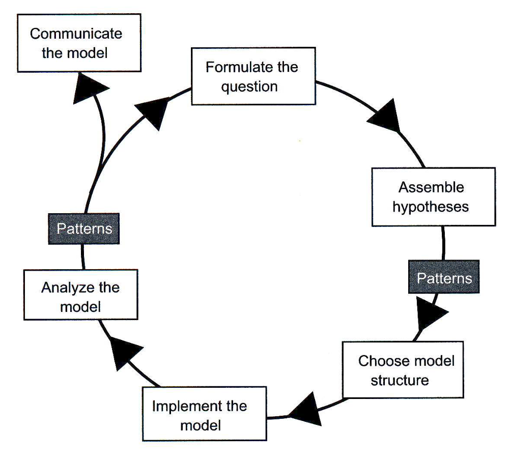
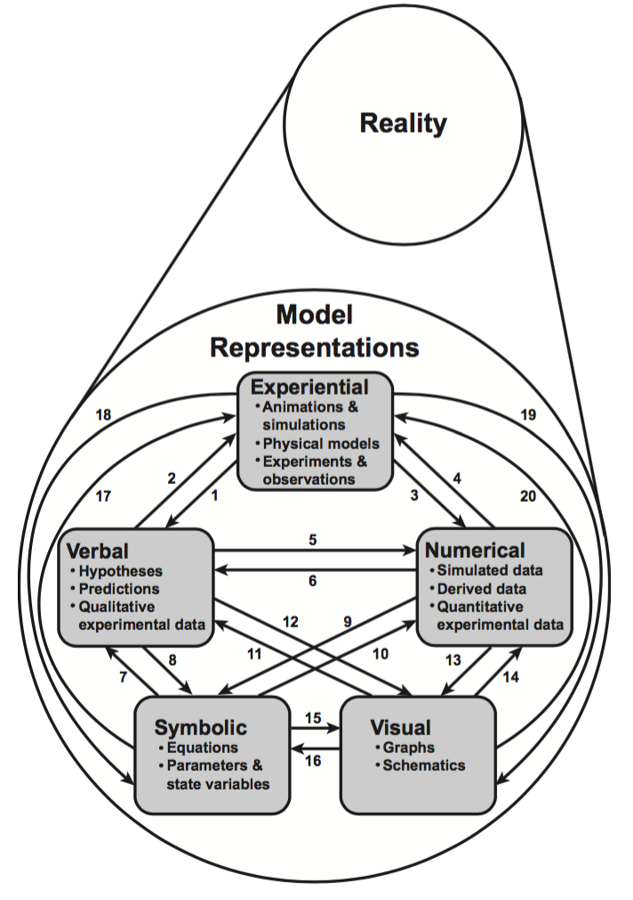

# Railsback & Grimm

> "In science, we usually want to <strong>understand</strong> how things work, <strong>explain</strong> patterns that we have observed, and <strong>predict</strong> a system's behavior in response to some change."

# Course Announcements

::: {.incremental}
 - Please bring your laptops to class and lab this week
 - Readings
    - Please read Chapter 1: Models, Agent-Based Models, and the Modeling Cycle
    - Please read Chapter 2: Getting Started with NetLogo
:::

# Phenomenological vs mechanistic

> 
<strong>Mechanistic model:</strong> A hypothesized relationship between the variables in the data set where the nature of the relationship is specified in terms of the <emph>biological processes</emph> that are thought to have given rise to the data. The parameters in the mechanistic model all have biological definitions and so they can be measured independently of the data set referenced above.
 

## Phenomenological vs mechanistic

> 
<strong>Phenomenological/Statistical model:</strong> A hypothesized relationship between the variables in the data set, where the relationship seeks only to best describe the data.
 

## Phenomenological vs mechanistic

From Bolker (2008) Ecological models and Data in R, p7:

> "All other things being equal, mechanistic models are more powerful since they tell you about the underlying processes driving patterns. They are more likely to work correctly when extrapolating beyond the observed conditions."

## Phenomenological vs mechanistic

From "Ecological Detective" by Hilborn and Mangel:

> "A statistical model foregoes any attempt to explain why the variables interact the way they do, and simply attempts to describe the relationship, with the assumption that the relationship extends past the measured values. Regression models are the standard form of such descriptions..."

## Regression

::: {.incremental}
- Regressions are used to **predict** and sometimes **infer causation**.
- For prediction, causative inference is not needed.
- Regression parameters give **associative/phenomenological** relationship between variables.
- To infer causation with regression, additional techniques are necessary to properly interpret slope parameters as causative influence.
:::

# Mechanistic Modeling 

## Process-driven modeling

## The process-driven modeling cycle {.smaller}

:::: {.columns}

::: {.column width="50%"}

:::

::: {.column width="50%"}

::: {.incremental}
 1. **Formulate the question** and **Assemble hypotheses**:  The Scientific "Deep Thinking" part
 2. **Choose model structure**:  Model Design $\leftrightarrow$ Experimental Design
 3. **Implement the model**:  Model formulation, model fitting, model diagnostics, and model selection.
 3. **Analyze the model**:  What _information_ is contained in our model?  What does it imply or predict about the real world?
 
:::

:::

::::

## Model Diagnostics {.smaller}

:::: {.columns}

::: {.column width="50%"}

From Railsback & Grimm:

> "Because the assumptions in the first version of a model are experimental, we have to test whether they are appropriate and useful.  For this, we need criteria for whether the model can be considered a good representation of the real system.  These criteria are based on <strong>patterns</strong> or regularities that let us identify and characterize the real system in the first place."

:::

::: {.column width="50%"}

tl;dr -> 

::: {.incremental}
 * Statistical models are validated by comparison to _quantitative information (**data**)_.  
 * Mechanistic models are validated by comparison to _qualitative information (**patterns**)_.
:::
 
:::
 
::::
 
# Process of modeling (POM)

## Non-linear process

Process of modeling (POM) is not "linear"!

. . .

**Just like process of science (POS)**

## 1. Formulate the question

> "We need to start with a very clear research question..."

. . .

> "Very often, even our questions are only experimental and later we might need to reformulate the question, perhaps because it turned out to be not clear enough, or too simple, or too complex."

## 2. Assemble hypotheses... {.smaller}

...for essential processes and structures

. . .

> "But whatever technique we prefer, this task has to combine existing knowledge and understanding, a 'brainstorming' phase in which we wildly hypothesize, and, most importantly, a simplification phase."

. . .

> "The modeling cycle must be started with the most simple model possible, because we want to develop understanding gradually, while iterating through the cycle."

. . .

> "...just our preliminary understanding of a system is not sufficient for deciding whether things are more or less important for a model.  _It is the very purpose of the model to teach us what is important_."

## 3. Choose model structure

> 
<strong>Definition:</strong> A <emph>model</emph> is a concrete or abstract simplification of objects and their relationships or processes in the real world.

. . .

In this step, we choose:

::: {.incremental}
 * Objects (spatial scale, entities, state variables, parameters)
 * Processes (time scale, parameters)
:::

. . .

### Verbal formulation of the model!!
 
## 4. Implement the model

### Mathematical or computational formulation of the model!!

## 5. Analyze, test, and revise the model

### Doing science with models

:::{.incremental}
 * Extract information from model through:
   * Simulation
   * Analysis
  
 * Use results to:
   * Explain
   * Predict
   * Use as evidence for hypotheses
:::

## Railsback & Grimm - Exercise 1

> 
<strong>Exercise 1:</strong> One famous example of how different models must be used to solve different problems in the same system is grocery store checkout queues.
 

. . .

::: {.incremental}
 1. _Who_ is asking the question and for whom will the model affect? (**stakeholders**)
 2. _Why_ are the stakeholders wanting to model the situation? (**model function**)
 3. _What_ are the relevant **objects and processes**?
 4. _How_ should it be modeled? (**model type**)
:::

## Railsback & Grimm - Exercise 1

 1. _Who_ is asking the question and for whom will the model affect? (**stakeholders**)
 2. _Why_ are the stakeholders wanting to model the situation? (**model function**)
 3. _What_ are the relevant **objects and processes**?
 4. _How_ should it be modeled? (**model type**)

> 
<strong>Customer:</strong> If you are a customer deciding which queue to enter, how would you model the problem?
 

## Railsback & Grimm - Exercise 1

 1. _Who_ is asking the question and for whom will the model affect? (**stakeholders**)
 2. _Why_ are the stakeholders wanting to model the situation? (**model function**)
 3. _What_ are the relevant **objects and processes**?
 4. _How_ should it be modeled? (**model type**)

> 
<strong>Manager:</strong> If you were a store manager deciding how to operate the queues for the next hour or so, what questions would your model address and what would it look like?
 

## Railsback & Grimm - Exercise 1

 1. _Who_ is asking the question and for whom will the model affect? (**stakeholders**)
 2. _Why_ are the stakeholders wanting to model the situation? (**model function**)
 3. _What_ are the relevant **objects and processes**?
 4. _How_ should it be modeled? (**model type**)
 
> 
<strong>Designer:</strong> If you were a store designer and the question is how to design the checkout area so that 100 customers can check out per hour with the fewest employees, what things would you model?
 